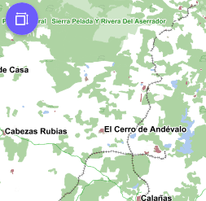

# M.plugin.FullViewMap

Plugin que permite poner a pantalla completa el mapa.



## Dependencias

- fullviewmap.ol.min.js
- fullviewmap.ol.min.css


```html
 <link href="../../plugins/fullviewmap/fullviewmap.ol.min.css" rel="stylesheet" />
 <script type="text/javascript" src="../../plugins/fullviewmap/fullviewmap.ol.min.js"></script>
```

## Parámetros

- El constructor se inicializa con un JSON de _options_ con los siguientes atributos:

- **position**. Indica la posición donde se mostrará el plugin
    - 'TL':top left
    - 'TR':top right (default)
    - 'BL':bottom left
    - 'BR':bottom right

## Eventos


## Otros métodos


## Ejemplos de uso

### Ejemplo 1
```javascript
   const map = M.map({
     container: 'map'
   });

   const mp = new M.plugin.FullViewMap({
        position: 'TL',
      });

   map.addPlugin(mp);
```
### Ejemplo 2
```javascript
const map = M.map({
     container: 'map'
   });

const mp = new M.plugin.FullViewMap({});

map.addPlugin(mp);
```
